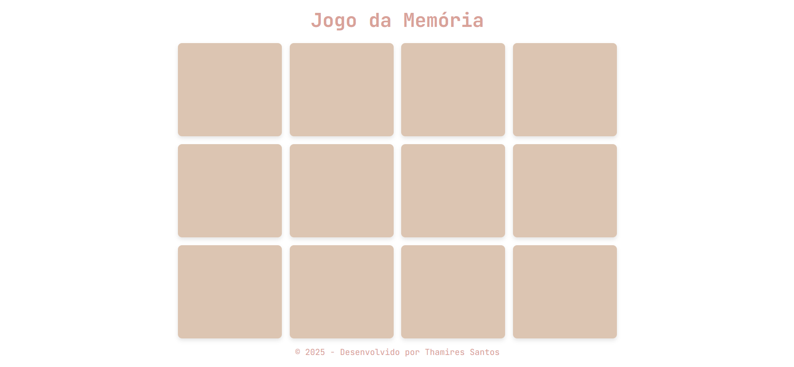

# Jogo da Memória 🧠

Bem-vindo ao Jogo da Memória! Este é um jogo clássico e responsivo, criado para desafiar sua memória e, ao mesmo tempo, aprimorar minhas habilidades em desenvolvimento web.

---

### **Índice**

- [Sobre o Projeto](#sobre-o-projeto)
- [Tecnologias Utilizadas](#tecnologias-utilizadas)
- [Funcionalidades](#funcionalidades)
- [Como Jogar](#como-jogar)
- [Contato](#contato)

---

### **Sobre o Projeto**

O Jogo da Memória é um projeto de front-end que simula o famoso jogo de encontrar pares. Meu principal objetivo com este projeto foi aprimorar minha **lógica de programação** e manipulação do **DOM** com **JavaScript**. Pela primeira vez, utilizei um algoritmo para embaralhar as cartas, o **Fisher-Yates**, o que me permitiu entender melhor como garantir uma aleatoriedade justa no jogo.

---

### **Tecnologias Utilizadas**

Este projeto foi construído puramente com tecnologias web front-end:

- **HTML5:** Para a estrutura e conteúdo da página.
- **CSS3:** Para a estilização e responsividade.
- **JavaScript:** Para a lógica do jogo, como o embaralhamento e a comparação das cartas.

---

### **Funcionalidades**

- **Embaralhamento Inteligente:** As cartas são embaralhadas de forma aleatória a cada rodada, graças ao algoritmo **Fisher-Yates**.
- **Design Responsivo:** O jogo se adapta perfeitamente a diferentes tamanhos de tela.
- **Tema:** As cartas são ilustradas com fotos fofas de gatinhos e cachorrinhos.

---

### **Como Jogar**

É muito simples! Como este é um projeto de front-end puro, você não precisa de nenhuma instalação ou configuração especial.

1. Acesse o link do jogo: **(https://thamiresantos.github.io/jogo-da-memoria/)**
2. Clique nas cartas para virá-las.
3. Encontre todos os pares!

---

### Contato
* [Github](https://github.com/thamiresantos)
* [Instagram](https://www.instagram.com/codewiththa/)
* [Linkedin](https://www.linkedin.com/in/thamires-santos-a9a652263) 
